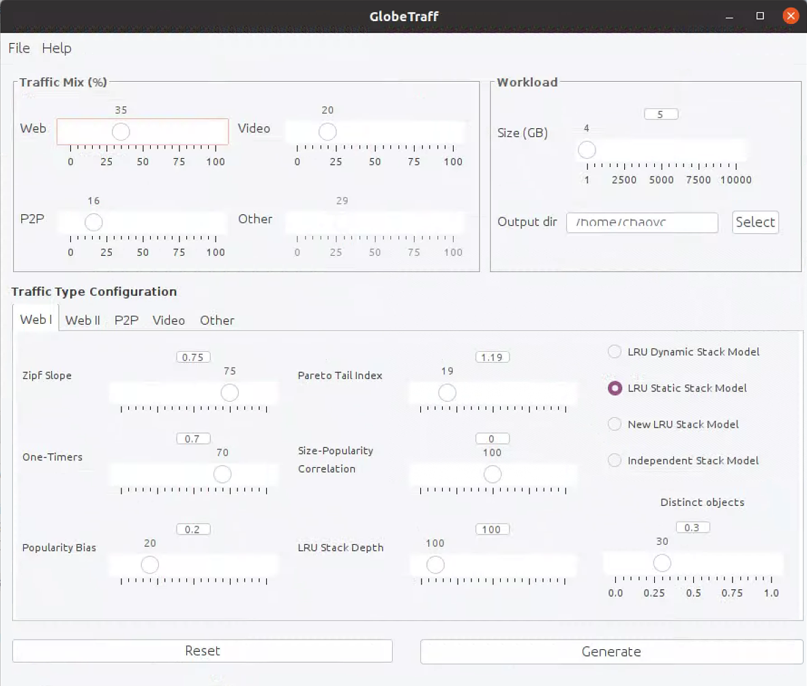

# What is GlobeTraff
GlobeTraff is a traffic workload generator for the creation of synthetic traffic mixes. It was proposed by Konstantinos V. Katsaros et al. of Athens University of Economics and Business in 2012. Readers can refer to their published paper for more details.

> [GlobeTraff: A Traffic Workload Generator for the Performance Evaluation of Future Internet Architectures](https://ieeexplore.ieee.org/document/6208742)

# How to install GlobeTraff
 the extended ProwGen code and it can be compiled by simply running the "setup" script. 

**1. Run the "setup" script in the project root directory**

`./setup`

Or you can execute the commands one by one, according to the content of the "setup" script. This can help you quickly locate the error.

**2. Import "JavaGUI" project into your NetBeans**

Directly build & run the project. If no errors are thrown, you should see the following GUI.

# How to use GlobeTraff

